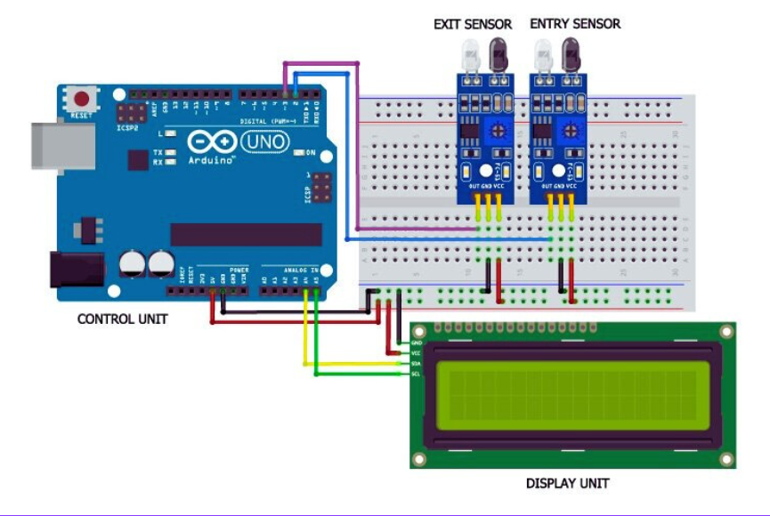
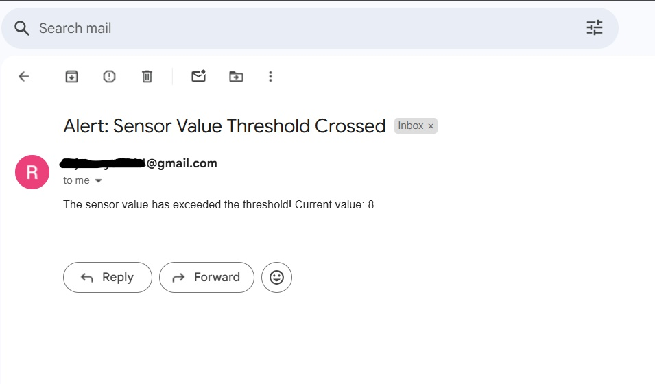

# 🚀 Smart PQ Counter – IR Sensor Based Intelligent People Counter System

**“When Software Meets Hardware: A Smart Step into Intelligent Automation”**

This project is a smart **People Counting System** that integrates both **hardware (IR sensors + Arduino)** and **software (Python + Flask + MySQL)** to monitor the number of people entering and exiting a room. It logs the count in real-time and displays it through a live interface.

---

## 📸 Project Preview

> 
> 


> 
> 

> 

---

## 🧠 Project Summary

The **Smart PQ Counter** uses two IR sensors connected to Arduino to track entry/exit:

- **Entry:** IR Sensor 1 → IR Sensor 2 → Count ++  
- **Exit:** IR Sensor 2 → IR Sensor 1 → Count --

>* The Arduino sends the data to Python via USB Serial.
>* Flask handles the backend and displays the data.
>* Alerts are sent via email when thresholds are crossed.
>* Data is stored in a MySQL database.

---

## 🛠️ Tech Stack

### 💡 Hardware:
- Arduino UNO
- IR Sensors
- USB Serial Cable

### 💻 Software:
- Python 3.x
- Flask
- PySerial
- MySQL
- HTML / CSS (tailwind) / JS & etc...

---

## 📁 Folder Structure

SmartPQCounter/
├── arduino_code.cpp           # C++ code for IR sensor-based people counting  
├── app.py                     # Main Flask application  
├── serial_reader.py           # Reads data from serial port (USB)  
├── serial_db.py               # Handles MySQL DB interactions  
├── email_alert.py             # Sends email alerts when threshold is crossed  
├── check.py                   # Utility/testing script  
├── requirements.txt           # Python dependencies  
├── README.md                  # Project overview and setup instructions  
├── templates/                 # HTML files (Flask templates)  
├── static/                    # CSS, JS, and assets  
└── images/                    # Screenshots, diagrams, or flowcharts


---

## 🔧 How to Run

1. Flash `arduino_code.cpp` to Arduino.
2. Install Python dependencies:
   ```bash
   pip install -r requirements.txt
3 . python app.py


## ✅ Applications
- Classrooms

- Offices

- Libraries

- Shopping Malls

- Hospitals

## 💎 Features
- Real-time people counting

- Sensor logic handling

- Web-based monitoring

- Email alert system

- MySQL data logging

## 🌱 Future Scope
- Replace IR with Camera + OpenCV

- Dashboard with analytics

- Cloud database & deployment

- Mobile-friendly frontend
